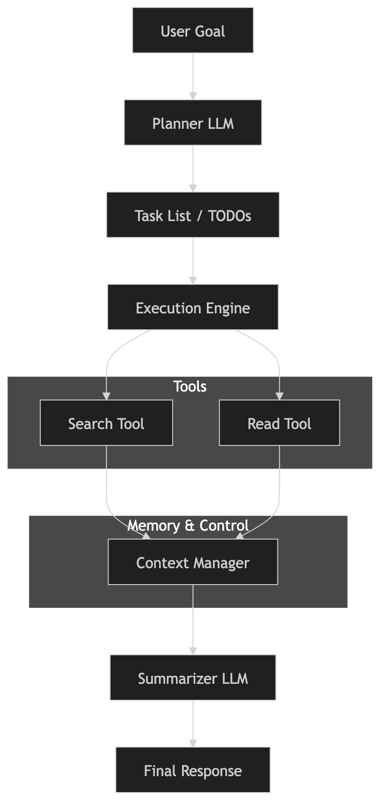

# Research Assistant Agent

An Basic AI agent that transforms high-level user goals into executable tasks and completes them using real-world tools. This project is built from scratch, without relying on frameworks like LangChain, CrewAI, etc to demonstrate the fundamentals of agent design, reasoning, and execution.

## Goal of the Project

The core focus here is on robust execution. We turn users goals into structured plans, run tasks one by one, handle errors gracefully, and manage limited context effectively to keep things running smoothly.

## Key Highlights

- **Goal → Plan → Execute → Report Pipeline**: A straightforward flow from input to output.
- **Dynamic Task Generation**: Uses LLM reasoning to break down goals into actionable steps.
- **Tool Integration**: Includes search and URL reading capabilities with built-in fallbacks.
- **Context Management**: Employs a sliding window and truncation to stay within limits.
- **Proper Logs**: Detailed execution logs for easy debugging and building trust.
- **Failure Recovery**: Automatic fallbacks when tools encounter issues.

## Architecture Overview

The agent follows a simple yet effective pipeline:

```
User Goal
   ↓
Task Planner (LLM)
   ↓
TODO List
   ↓
Execution Loop
   ├── Search Tool
   ├── Read Tool
   └── Summarization
   ↓
Final Response
```


## Agent Workflow

1. **Planning**: The agent takes the user goal and converts it into a list of structured tasks. Each task has a description, type, and query to guide execution.
2. **Execution**: Tasks are run one after another. Progress is tracked, and intermediate results are stored for reference.
3. **Reporting**: All outputs are gathered and summarized into a clear, structured final response.

## Context Strategy

To prevent token limits from causing issues while keeping responses relevant, we manage context carefully:

- Retain the original goal and current task.
- Keep the last 2–3 steps in memory.
- Truncate lengthy outputs to 500–1000 characters.
- Discard older, less important information.

## Evaluation Coverage

We test the agent across various scenarios to ensure reliability:

| Scenario          | What It Tests                  |
|-------------------|--------------------------------|
| Fact Retrieval    | Accuracy and speed             |
| Comparison Tasks  | Decomposition and reasoning    |
| Ambiguous Goals   | Handling clarification         |
| Tool Failure      | Resilience and fallback        |
| Long Context      | Memory and summarization       |

## Trade-offs

- **No Frameworks**: Gives us full control but requires more effort to implement.
- **Sequential Execution**: Keeps things simple and predictable, though it's slower than running tasks in parallel.
- **Lightweight Memory**: Efficient for most cases, but doesn't offer perfect recall.

## Future Improvements

- Implement parallel task execution to boost speed.
- Upgrade to better memory systems, like vector databases for retrieval.
- Develop an easy-to-use plugin system for tools.
- Add evaluation metrics, such as precision and task success rates.
- Incorporate user feedback loops for continuous learning.
- Enhance reasoning with multi-hop and chain-of-thought techniques.
- Improve error handling and recovery strategies.
- Prioritize architecture and reliability.
